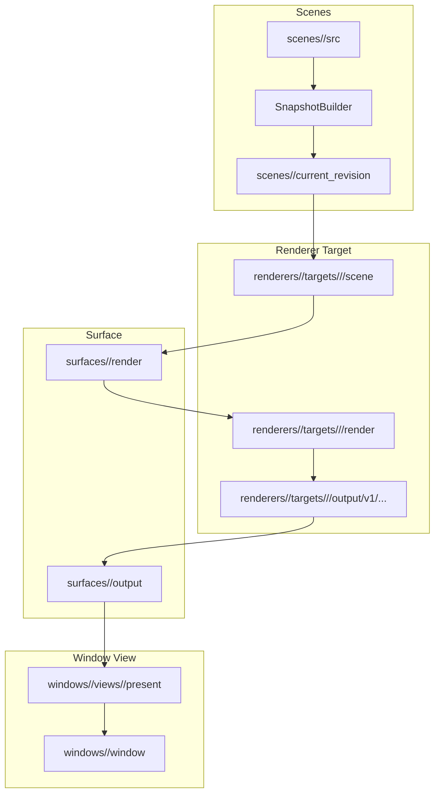
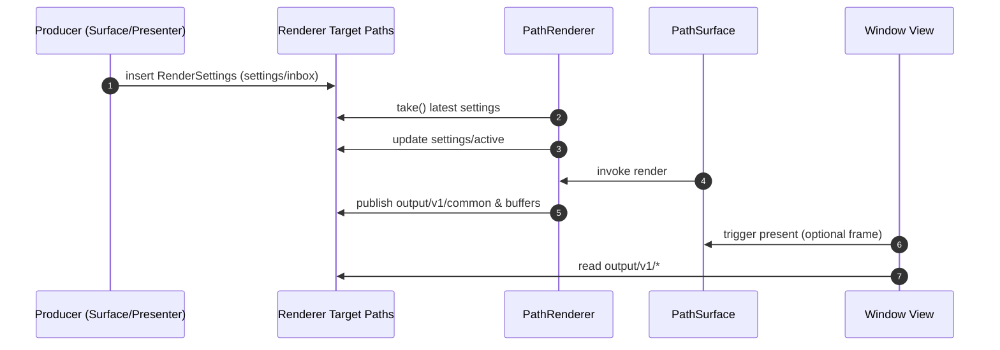

> **Update (October 28, 2025):** Captured the PathRenderer2D module split (`PathRenderer2DDamage/Encode/Color`, shared `PathRenderer2DDetail*`) plus the UI builder translation-unit refactor so this doc mirrors the current code layout and cross-links stay accurate.
> **Handoff note (October 19, 2025):** This document reflects the outgoing assistant cycle and is retained for historical reference. New AI maintainers should begin with `docs/AI_Onboarding_Next.md` for current workflow expectations and update this file only after aligning with the latest plan.

Renderer snapshot builder details have moved out of this architecture document. See docs/finished/Plan_SceneGraph_Renderer_Finished.md (“Decision: Snapshot Builder”) for the authoritative policy, rebuild triggers, publish/GC protocol, and performance notes. This file focuses on PathSpace core (paths, trie storage, concurrency/wait/notify, views/alias layers, and OS I/O). New AI assistants should first walk through docs/AI_Onboarding.md for the session bootstrap checklist.

> **Declarative-first note (November 28, 2025):** All UI work now flows through the declarative widget runtime documented in `docs/WidgetDeclarativeAPI.md`. The legacy imperative builders have been removed from the tree; any references in this file describe the former architecture for historical context. Cross-check the declarative guide before editing UI code.
> **Renderer knobs (November 28, 2025):** `RendererKind`, `RenderSettings`, and `DirtyRectHint` now live under `SP::UI::Runtime` in `<pathspace/ui/runtime/RenderSettings.hpp>`. Builder headers alias the runtime types for compatibility, so new renderer/presenter code should include the runtime header directly instead of `Builders.hpp` when it only needs these knobs.
> **UITest update (November 27, 2025):** The legacy `tests/ui/test_Builders.cpp` suite has been retired. Declarative coverage for widgets/focus/dirty hints now lives in `tests/ui/test_DeclarativeWidgets.cpp`, `tests/ui/test_WidgetEventTrellis.cpp`, `tests/ui/test_DeclarativeSceneLifecycle.cpp`, and the other declarative UITests referenced throughout this file.
> **Context update (October 15, 2025):** PathSpace documentation now assumes the assistant context launched for this cycle; earlier references to legacy contexts should be interpreted accordingly.
> **Concurrency update (November 14, 2025):** PathSpaceTrellis redesign completed; see `docs/finished/Plan_PathSpaceTrellis_Finished.md` for the final fan-in notes. Historical background remains in `docs/finished/Plan_PathSpace_FanIn_Abandoned.md`.
> **Minimal diagnostics (December 27, 2025):** Renderer target hints, present/residency metrics, and trellis/runtime counters now emit only when `PATHSPACE_UI_DEBUG_TREE=1` (aliases: `PATHSPACE_UI_DEBUG_DIAGNOSTICS`, `PATHSPACE_UI_DEBUG_PATHSPACE`). Default runs leave those branches empty so hierarchical dumps stay lean.
> **Minimal themes (December 27, 2025):** Runtime bootstrap no longer writes `config/theme/<name>/value`; only `config/theme/active` is seeded. Theme resolution falls back to built-in palettes when the compiled blob is absent, while explicit theme edits still persist the value.
> **GPU hooks (December 31, 2025):** SceneGraph tiled renderer is now the default software path (opt-out via `PATHSPACE_DISABLE_TILED_RENDERER` or `PATHSPACE_ENABLE_TILED_RENDERER=0`); `TileEncoderHooks` remain opt-in for Metal/Vulkan encoders.

## UI/Rendering — cross-reference

Present policy (backend-aware) and the software progressive present are documented in docs/finished/Plan_SceneGraph_Renderer_Finished.md. This architecture document focuses on PathSpace core; rendering/presenter details live in the plan. Also see “View keys (final)” and “Target keys (final)” in docs/finished/Plan_SceneGraph_Renderer_Finished.md for the authoritative schemas, and note that RenderSettings are a single-path atomic whole-object value; ParamUpdateMode::Queue refers to client-side coalescing before one atomic write (no server-side queue in v1).

### Text shaping and font pipeline (December 10, 2025)
- Stack: HarfBuzz + FreeType for shaping and outline access; ICU is optional for script/line-break hints; CoreText is discovery-only on Apple platforms.
- Atlases: MSDF/Alpha8 atlases remain the default for UI text; bitmap atlases backstop very small sizes that need hinting/LCD. Color glyphs (emoji, COLR/CPAL, SBIX) persist a parallel RGBA page at `resources/fonts/<family>/<style>/builds/<rev>/atlas_color.bin`; `meta/atlas/{hasColor,preferredFormat}` records availability and the preferred lane.
- Caching and residency: shaped-run cache keys include `{text, script, direction, font-set, features}`; atlas residency budgets live under `meta/atlas/{softBytes,hardBytes,shapedRunApproxBytes}` with per-target metrics exposed via `diagnostics/metrics/fonts/*` and snapshot `font_assets` so renderers can pin the correct atlas revision without reshaping.
- Fallbacks: font families accept CSS-style fallback lists; `FontManager` resolves per-script chains and keeps variable-axis tuples in the cache key. Missing glyphs enqueue bake work; draw paths render available glyphs and refresh the region once the atlas updates.
- Error surfaces: loader/shaper failures emit `PathSpaceError` entries under `resources/fonts/<family>/<style>/diagnostics/errors`; renderer/HTML consumers mirror last-error fields into `output/v1/common/lastError*` for legacy dashboards.

> **Diagnostics note (October 16, 2025):** Presenter runs now persist the resolved present policy and age/staleness data (`presentMode`, `stalenessBudgetMs`, `frameTimeoutMs`, `maxAgeFrames`, `presentedAgeMs`, `presentedAgeFrames`, `stale`, `autoRenderOnPresent`, `vsyncAlign`) under `targets/<tid>/output/v1/common/*`. Renderer executions publish matching progressive statistics (`progressiveTilesUpdated`, `progressiveBytesCopied`) so tooling can correlate policy decisions with render work.
> **Diagnostics update (October 19, 2025):** `backendKind` and `usedMetalTexture` flag the presenter’s backend choice per frame so telemetry can distinguish Metal uploads from software fallbacks while the GPU encoder comes online.
> **Diagnostics update (October 19, 2025):** Dirty-rect hints are now coalesced at insert time and the full tile/damage/fingerprint metric set (`damage*`, `fingerprint*`, `progressiveTiles*`) is available when `PATHSPACE_UI_DAMAGE_METRICS=1`. Keep the flag unset for perf runs—the encode pass is still single-threaded today, and the next renderer milestone is to shard that work across core-count-sized tile queues.
> **Diagnostics update (October 29, 2025):** `Renderer::SubmitDirtyRects` stopped overwriting previously queued rectangles. The queue now accumulates per-widget hints so focus handoffs (e.g., widgets_example slider → list) clear the outgoing highlight on the very next frame; see `tests/ui/test_Builders.cpp` (“Widget focus slider-to-list transition covers highlight footprint”) for the regression coverage.
> **Diagnostics update (2025-10-17):** Software renderer incremental perf (64 px hints) holds ~140 FPS even at 4K, but full-surface damage and IOSurface reuse remain bottlenecks; see docs/finished/Plan_SceneGraph_Finished.md for the archived profiling/benchmark plan and docs/AI_Onboarding.md for the latest hand-off notes.
> **Presenter update (October 18, 2025):** CAMetalLayer presents remain zero-copy by default. Builders expose a `capture_framebuffer` flag under `windows/<win>/views/<view>/present/params/capture_framebuffer`; only when the flag is true do presenters copy the IOSurface back to RAM for diagnostics/tests.
> **Diagnostics update (October 18, 2025):** Presenter/renderer errors now populate `diagnostics/errors/live` with a structured `PathSpaceError` (code, severity, message, revision, timestamp). `output/v1/common/lastError` remains as a compatibility mirror, but tooling should consume `diagnostics/errors/live` for full context. CAMetalLayer presents rely on a bounded IOSurface reuse pool, eliminating the range-group exhaustion seen in early paint sessions.
> **Telemetry update (October 19, 2025):** Targets now publish residency/cache metrics under `diagnostics/metrics/residency/{cpuBytes,cpuSoftBytes,cpuHardBytes,gpuBytes,gpuSoftBytes,gpuHardBytes}`. Builders thread the configured cache limits from `RenderSettings.cache` so dashboards can compare actual usage against the soft/hard watermarks.
> **Telemetry update (October 20, 2025):** Residency metrics now also publish `cpuSoftBudgetRatio`, `cpuHardBudgetRatio`, `gpuSoftBudgetRatio`, `gpuHardBudgetRatio`, per-budget exceed flags, and `overallStatus` under `diagnostics/metrics/residency/` so dashboards and alerts can consume thresholds without bespoke parsing.
> **Damage helper update (December 4, 2025):** `PathRenderer2DDamage` now owns the dirty-rect/damage heuristics via `compute_damage`. `PathRenderer2D` simply asks the helper for the snapped region + tile hints, and `tests/ui/test_PathRenderer2D.cpp` exercises the helper directly so hint coalescing and fingerprint accounting stay regression-tested outside the renderer loop.
> **Renderer staging (October 19, 2025):** Builders can now provision Metal targets alongside the software path. The rendering pipeline still populates targets through the software raster; enabling true Metal uploads is gated behind the environment variable `PATHSPACE_ENABLE_METAL_UPLOADS=1` while we finish the GPU encoder. When the flag is unset (or PATHSPACE_UI_METAL is disabled at build time) render contexts automatically fall back to `RendererKind::Software2D` so the CPU path remains the default in tests and CI.

### Widget Namespace Summary (October 24, 2025 — declarative runtime)

> Declarative widgets own these namespaces via the runtime described in `docs/WidgetDeclarativeAPI.md`. The legacy builder files referenced throughout the docs still exist for consumers that have not migrated, but they should not be extended for new features; funnel all UI changes through the declarative helpers so the runtime can keep buckets, handlers, focus, and telemetry in sync.

- Widget roots live at `<app>/widgets/<widget-id>`. Roots encapsulate mutable state (`state`), canonical metadata (`meta/kind`), style/material data (`meta/style`, `meta/label`, `meta/range`, `meta/items`, `meta/nodes`), and interaction queues. In the capsule runtime (default) widgets declare `capsule/mailbox/subscriptions` and receive events under `capsule/mailbox/events/<topic>/queue`; legacy `ops/inbox/queue` and `ops/actions/inbox/queue` are only populated when capsule-only mode is explicitly disabled.
- Widget scenes mount under `<app>/scenes/widgets/<widget-id>` with immutable snapshots per state (`states/<state-name>/snapshot`) and `current_revision` pointing at the active revision. Builders stamp `meta/name` and `meta/description` on first publish to keep diagnostics readable.
- Focus routing keeps the active widget name at `<app>/widgets/focus/current`. Focus helpers update the value atomically and optionally enqueue auto-render events when focus shifts.
- Interaction bindings enqueue dirty hints via `Renderer::SubmitDirtyRects` and render requests under `renderers/<rid>/targets/<kind>/<name>/events/renderRequested/queue` when `auto_render` is enabled. Both queues rely on standard PathSpace atomic writes and wait/notify semantics.
- InputTask converts capsule mailbox events into `WidgetAction`s and dispatches reducer bindings; compatibility mode (`PATHSPACE_WIDGET_CAPSULES_ONLY=0`) still mirrors those actions into `/ops/actions/inbox/queue` and `/events/*/queue` for older consumers. The legacy `SP::UI::Runtime::Widgets::Reducers::*` wrappers continue to route through the declarative helpers after running the guard, so new code should avoid the builder headers for reducer work.
- Builder workflow: bootstrap renderer/surface/window with `Runtime::App::Bootstrap`, create widgets via `Runtime::Widgets::Create*`, bind interactions with `Runtime::Widgets::Bindings::Create*Binding`, pump reducers (`Widgets::Reducers::ReducePending` and `PublishActions`), and use `Runtime::App::UpdateSurfaceSize` / `PresentToLocalWindow` for resize + diagnostics loops. Each helper performs whole-object replaces so readers never see torn state.

Keep `docs/AI_PATHS.md` synchronized with new widget kinds or metadata keys and ensure tests mirror any path additions before merging.

## UI/Rendering — cross-reference

Present policy (backend-aware) and the software progressive present are documented in docs/finished/Plan_SceneGraph_Renderer_Finished.md. This architecture document focuses on PathSpace core; rendering/presenter details live in the plan. Also see “View keys (final)” and “Target keys (final)” in docs/finished/Plan_SceneGraph_Renderer_Finished.md for the authoritative schemas, and note that RenderSettings are a single-path atomic whole-object value; ParamUpdateMode::Queue refers to client-side coalescing before one atomic write (no server-side queue in v1).

See also:
- `docs/finished/Plan_SceneGraph_Renderer_Finished.md` for the broader rendering plan and target I/O layout. If snapshot semantics change, update both documents in the same PR per `.rules`.
 - `docs/AI_Paths.md` for the canonical path namespaces and layout conventions; update it alongside changes to path usage and target I/O layout.
- HTML render targets now persist adapter output under `renderers/<rid>/targets/html/<name>/output/v1/html/{dom,css,commands,assets,mode,usedCanvasFallback}`; see `Html::Adapter` for the serialization rules and SceneGraph plan Phase 7 for outstanding replay/CI work.


## Contributing to PathSpace

For AI-facing workflows (branching, PR creation, troubleshooting, commit guidelines), see AGENTS.md. This document focuses on code architecture and APIs.

PathSpace is a coordination language that enables insertion and extractions from paths in a thread safe datastructure. The data structure supports views of the paths similar to Plan 9. The data attached to the paths are more like a JSON datastructure than files though. The data supported is standard C++ data types and data structures from the standard library, user created structs/classes as well as function pointers, std::function or function objects for storing executions that generate values to be inserted at a path.

### Declarative Runtime Services (November 14, 2025)
- `SP::System::LaunchStandard` (`include/pathspace/ui/declarative/Runtime.hpp`) now performs end-to-end bootstrap for declarative UI runs:
  - Seeds `/system/themes/<name>` and app-local `config/theme/active`, then mirrors the normalized theme name into each window’s `style/theme`.
  - Ensures every app owns `renderers/widgets_declarative_renderer` plus per-view surfaces named `surfaces/widgets_surface_<window>_<view>`, wiring `windows/<id>/views/<view>/{surface,renderer,scene}` and mirroring those values under `scenes/<scene>/structure/window/<id>/{surface,renderer,present}`.
  - Starts the `/system/widgets/runtime/input` pump unless `LaunchOptions::start_input_runtime` is disabled. By default the worker drains `widgets/<widget>/capsule/mailbox/events/<topic>/queue`, dispatches reducer bindings, and maintains metrics under `/system/widgets/runtime/input/metrics/*` (`widgets_processed_total`, `widgets_with_work_total`, `actions_published_total`, `events_enqueued_total`, `events_dropped_total`, `last_pump_ns`). When compatibility is required (`PATHSPACE_WIDGET_CAPSULES_ONLY=0`), it also mirrors actions into legacy queues (`ops/actions/inbox/queue`, `events/inbox/queue`, and per-event queues such as `events/press/queue`). Failures enqueue strings to `/system/widgets/runtime/input/log/errors/queue`.
  - Starts the `/system/widgets/runtime/io` pump unless `LaunchOptions::start_io_pump` is disabled. The worker consumes `/system/io/events/{pointer,button,text}` and fans them into `/system/widgets/runtime/events/<window-token>/{pointer,button,text}/queue` based on the device subscriptions registered under `/system/widgets/runtime/windows/<window-token>/subscriptions/{pointer,button,text}/devices`, with `/system/widgets/runtime/events/global/*/queue` as the unmatched fallback.
  - Starts the `/system/widgets/runtime/events` routing trellis unless `LaunchOptions::start_widget_event_trellis` is disabled. `CreateWidgetEventTrellis` drains the per-window event queues, performs `Scene::HitTest`, and emits `WidgetOp`s for buttons/toggles (hover/press/release/activate/toggle), sliders (begin/update/commit), lists (hover/select/activate), trees (hover/toggle/select), and text inputs (focus/input), logging misses under `/system/widgets/runtime/events/log/errors/queue` and publishing telemetry to `/system/widgets/runtime/events/metrics/*` (`pointer_events_total`, `button_events_total`, `widget_ops_total`, `hit_test_failures_total`, `last_dispatch_ns`). The worker’s lifecycle flag lives at `/system/widgets/runtime/events/state/running`.
- `include/pathspace/ui/declarative/Widgets.hpp` exposes the declarative API surface. `WidgetFragment` + `Widgets::Mount` let callers author widgets entirely through fragments; `Button::Create`, `List::Create`, `Slider::Create`, etc., normalize styles/state, register handler bindings (`events/<event>/handler = HandlerBinding { registry_key, kind }`), and flip `render/dirty` automatically. `render/synthesize` now stores a `RenderDescriptor` (widget kind enum) instead of raw callables so renderers synthesize buckets directly from stored state/style.
- Call `SP::System::ShutdownDeclarativeRuntime(space)` in short-lived tests/examples to stop the pump; production apps can leave it running for the PathSpace lifetime.
- The runtime remains idempotent: repeated `LaunchStandard` runs reuse the existing scaffolding and report `LaunchResult::input_runtime_started = false` / `LaunchResult::io_pump_started = false` when those workers already exist.

##### IO runtime launch & environment knobs (November 17, 2025)

- `LaunchOptions::start_input_runtime` defaults to `true`. Disable it when embedding PathSpace into processes that already own an input loop (e.g., scripted tests or custom render hosts) so `LaunchStandard` skips `CreateInputTask`.
- `LaunchOptions::input_task_options` forwards directly to `InputTaskOptions`:
  - `poll_interval` (default 4 ms) controls how often the worker scans `/system/applications/<app>/widgets/*`. A value ≤ 0 falls back to 1 ms to guarantee progress.
  - `max_actions_per_widget` (default 64) caps how many pending reducer actions drain per widget during a single pass, providing predictable latency for large trees.
- `CreateInputTask` seeds `/system/widgets/runtime/input`:
  - `/system/widgets/runtime/input/state/running` reflects worker lifecycle.
  - `/system/widgets/runtime/input/metrics/{widgets_processed_total,widgets_with_work_total,actions_published_total,last_pump_ns}` accumulate per-pass stats so tooling can spot stalls.
  - `/system/widgets/runtime/input/metrics/{handlers_invoked_total,handler_failures_total,handler_missing_total,last_handler_ns}` track dispatch activity so tooling can spot missing bindings, handler crashes, or long stalls between successful callbacks.
  - `/system/widgets/runtime/input/log/errors/queue` collects stringified reducer failures. Global logging env toggles (`PATHSPACE_LOG`, `PATHSPACE_LOG_ENABLE_TAGS`, `PATHSPACE_LOG_SKIP_TAGS`) still govern whether host-side logs emit additional diagnostics, but the authoritative record for pump failures is this queue.
  - After reducers publish `WidgetAction`s, the worker mirrors each payload into `widgets/<widget>/events/inbox/queue` plus the per-event queue before resolving `events/<event>/handler = HandlerBinding`, invokes button/toggle/slider/list/tree/input handlers, and records any registry mismatches or exceptions back to the log + metrics roots.
- `PumpWindowWidgetsOnce` exposes a synchronous escape hatch for tests/tools that need deterministic progress on a single window/view. It walks `/windows/<id>/views/<view>/widgets`, optionally sweeps the app-local `/widgets` subtree, and publishes per-window+per-app counters under `/system/widgets/runtime/input/windows/<token>/metrics/*` and `/system/widgets/runtime/input/apps/<app>/metrics/*` (widgets/actions/manual_pumps totals plus `last_manual_pump_ns`). UITests can wait on those nodes instead of the global metrics to prove their newly mounted widgets were serviced even while the background worker is busy with other applications.
- `SceneLifecycle::PumpSceneOnce` mirrors this idea for the lifecycle worker. It runs on the lifecycle thread, registers newly mounted widgets, optionally re-marks them dirty, processes pending `render/dirty` nodes, and reports `ManualPumpResult{widgets_processed,buckets_ready}` before returning. `PathSpaceExamples::ensure_declarative_scene_ready` enables it automatically (`pump_scene_before_force_publish`) so compile-loop runs can force publish immediately even after a clean build. Tests can also call it directly to prove buckets exist before asserting on snapshot metrics.
- `LaunchOptions::start_io_pump` defaults to `true`. Disable it when embedding PathSpace into a host that performs its own event routing. `LaunchOptions::io_pump_options` expose the pump-level timeouts (block, idle sleep, subscription refresh cadence), metrics root, events root, windows root, and an optional shared `stop_flag` for deterministic shutdown.
- `CreateIOPump` seeds `/system/widgets/runtime/io/state/running`, keeps `/system/widgets/runtime/input/metrics/{pointer_events_total,button_events_total,text_events_total,events_dropped_total,last_pump_ns}` up to date, and republishes normalized IO Trellis events into per-window queues:
  - Windows register under `/system/widgets/runtime/windows/<token>` with `window = <absolute window path>` and `subscriptions/{pointer,button,text}/devices = ["/system/devices/in/<class>/<id>", ...]`. Tokens default to `MakeRuntimeWindowToken(window_path)` (path string with non-alphanumerics replaced by `_`).
  - Routed events land at `/system/widgets/runtime/events/<token>/{pointer,button,text}/queue`. When no subscription claims a device path the event falls through to `/system/widgets/runtime/events/global/{pointer,button,text}/queue` so diagnostics and legacy tooling can continue consuming the stream.
  - Errors enqueued while routing are mirrored into `/system/widgets/runtime/input/log/errors/queue` alongside reducer failures for a single debugging surface.
- `LaunchOptions::start_io_telemetry_control` defaults to `true`. The helper wraps `CreateTelemetryControl`, which watches `/_system/telemetry/start/queue`, `/_system/telemetry/stop/queue`, `/_system/io/push/subscriptions/queue`, and `/_system/io/push/throttle/queue`, then fans out the requested toggles across `/system/devices/in/<class>/<id>/config/push/*`. Options live in `TelemetryControlOptions` (state path, queue roots, log path, timeouts) and the worker publishes its running state at `/_system/telemetry/io/state/running` plus stringified failures to `/_system/telemetry/log/errors/queue`.
  - Telemetry toggles: push `TelemetryToggleCommand{.enable=true}` to the start queue (or `.enable=false` to the stop queue) to flip `/_system/telemetry/io/events_enabled` and mirror the setting to every device’s `config/push/telemetry_enabled` leaf.
  - Device push control: queue `DevicePushCommand` entries under `/_system/io/push/subscriptions/queue`. `device` accepts an absolute path, `/system/devices/in/<class>/*` prefix, or `"*"`; the worker updates `config/push/enabled` (when `touch_push_enabled` is true) and `config/push/subscribers/<name>` on every match, with optional telemetry overrides per device. When `.subscriber` is empty the controller uses `TelemetryControlOptions::default_subscriber` (defaults to `io_trellis`) so legacy callers do not need to fill the field manually.
  - Throttling: send `DeviceThrottleCommand` entries through `/_system/io/push/throttle/queue` to update `config/push/rate_limit_hz` / `config/push/max_queue` for the specified devices. Leave `device="*"` to broadcast to every device class registered under `/system/devices/in`.
- `LaunchOptions::start_widget_event_trellis` defaults to `true`. `widget_event_options` expose the routing worker’s refresh cadence, path roots (`windows_root`, `events_root`, `metrics_root`, `log_root`, `state_path`), and an optional `hit_test_override` hook for tests. `CreateWidgetEventTrellis` keeps `/system/widgets/runtime/events/state/running` updated, mirrors metrics to `/system/widgets/runtime/events/metrics/{pointer_events_total,button_events_total,widget_ops_total,hit_test_failures_total,last_dispatch_ns}`, and logs failures to `/system/widgets/runtime/events/log/errors/queue`. The current implementation emits `WidgetOp`s for buttons/toggles, sliders, lists, trees, and text inputs; paint-surface gestures and stack-panel switches still need declarative routes before those handler paths receive live events.
- Provider-facing environment/configuration is exposed through `DevicePushConfigNodes` (see `src/pathspace/layer/io/DevicePushConfigNodes.*`):
  - `/system/devices/in/<class>/<id>/config/push/enabled` (bool, default `false`) is flipped by pumps/consumers that want events pushed instead of polling.
  - `.../config/push/rate_limit_hz` (uint32, default 240) and `.../config/push/max_queue` (uint32, default 256) bound provider throughput.
  - `.../config/push/telemetry_enabled` gates per-device counters; keep it `false` in latency-sensitive scenarios unless telemetry has been requested via `/_system/telemetry/start`.
  - `.../config/push/subscribers/<name>` (bool) lets each pump register interest so devices only publish when at least one subscriber is active. The IO Trellis + IO Pump will subscribe under stable names once their phases land.
- `CreateIOTrellis(PathSpace&, IoTrellisOptions const&)` (see `include/pathspace/io/IoTrellis.hpp`) mounts the IO Trellis worker. It discovers `/system/devices/in/{pointer,text,keyboard,gamepad}/*`, ensures `config/push/enabled=true`, registers itself under `config/push/subscribers/<subscriber_name>`, drains the provider queues, and emits normalized structs (`PointerEvent`, `ButtonEvent`, `TextEvent`) into `/system/io/events/{pointer,button,text}`. Options cover:
  - `subscriber_name` (default `io_trellis`) so multiple consumers can coexist without clobbering one another.
  - Event wait/idle sleep/discovery intervals (milliseconds) to balance latency vs. CPU usage.
  - Telemetry roots: `telemetry_toggle_path` defaults to `/_system/telemetry/io/events_enabled` (false by default) and `metrics_root` defaults to `/system/io/events/metrics`.
  - Device-class enable flags so callers can temporarily disable keyboard/gamepad listeners in test harnesses.
- When `/ _system/telemetry/io/events_enabled` flips true, `CreateIOTrellis` publishes rolling totals under `/system/io/events/metrics/{pointer_events_total,button_events_total,text_events_total}`. Leave the flag unset for production runs where the extra writes would contend with input latency.
- Tests that need declarative scaffolding without the worker threads should set `launch_options.start_input_runtime = false` and `launch_options.start_io_pump = false`, then manually call `CreateInputTask`, `CreateIOTrellis`, or `CreateIOPump` as needed.

### Undo History Layer Guidance
- Each history-enabled subtree owns exactly one undo/redo stack. We do not coordinate history across multiple roots; a logical command must mutate a single root so one stack captures the full change.
- If a feature naturally spans several areas, route it through a command-log subtree or reorganize the data so related metadata lives alongside the primary payload before enabling history. `enableHistory` now rejects configurations that expect shared stacks—setting the same `HistoryOptions::sharedStackKey` on multiple roots triggers an error so callers regroup under a single undo root instead.
- Undo entries flush to disk by default for crash safety. Advanced callers can set `HistoryOptions::manual_garbage_collect` or insert `_history/set_manual_garbage_collect = true` when they want to defer durability and retention to explicit checkpoints.
- December 9, 2025: retention budgets and persistence flags now emit through `_history/stats/limits/*` (see `HistoryLimitMetrics` in `history/UndoableSpace.hpp`). Inspector panels and declarative widgets consume those nodes directly instead of inferring budgets from savefiles. Compaction counters also mirror under `_history/stats/compaction/*`, aliasing the trim metrics for dashboards while keeping the legacy `_history/stats/trim*` fields intact.
- November 10, 2025: `history::UndoableSpace` now journals mutations instead of taking copy-on-write snapshots. The mutation log records inserts/takes plus inverse payloads so undo/redo replay quickly without walking the trie. Retention budgets still apply (auto-trim plus manual garbage collect), `_history/stats/*` and `_history/lastOperation/*` are derived from `UndoJournalState::Stats`, and `_history/unsupported/*` continues to log nodes we cannot serialize (executions, nested spaces) because those payloads are skipped when we capture before/after state.
- December 10, 2025: History metadata now accepts user-provided tags. Writing `_history/set_tag = "<label>"` (std::string payload) stamps the label onto each journal entry and mirrors it to `_history/lastOperation/tag`, so dashboards and UI bindings can display friendly command names next to undo/redo telemetry.
- December 10, 2025: History telemetry is mirrored into `/diagnostics/history/<encoded-root>/` (compatibility mirror `/output/v1/diagnostics/history/<encoded-root>/`) to keep inspector/HTML tooling out of user namespaces. The mirror surfaces `_history/stats/*`, `_history/lastOperation/*`, and per-entry metadata under `entries/<sequence>/{operation,path,tag,timestampMs,monotonicNs,barrier,valueBytes,inverseBytes,hasValue,hasInverse}` plus `head/sequence` for discovery.
- November 7, 2025: Persistence metadata now serializes through a versioned little-endian binary header shared across recovery, telemetry, and tooling. Alpaca JSON output was retired; `_history/stats/*` remains the authoritative introspection surface for inspectors/CLIs.
- Migration: Legacy snapshot persistence requires a bridge export. Check out the November 9, 2025 bridge commit (`git log --before '2025-11-10' -1` to locate the hash), export with `pathspace_history_savefile export --root <path> --history-dir <dir> --out <bundle>.history.journal.v1` (the Example CLI surface now adds `--help`, shared validation, and optional `--persistence-root/--namespace` overrides), then import on the current build. Step-by-step commands and validation checks live in `docs/AI_Debugging_Playbook.md` (“Undo journal migration runbook”).
- November 22, 2025: Declarative samples wire undo via `SP::UI::Declarative::HistoryBinding` (`include/pathspace/ui/declarative/HistoryBinding.hpp`). Call `InitializeHistoryMetrics`, `CreateHistoryBinding`, `RecordHistoryBindingActionResult`, `SetHistoryBindingButtonsEnabled`, and `PublishHistoryBindingCard` instead of cloning bespoke `UndoableSpace` glue; the helper seeds `/widgets/<id>/space/metrics/history_binding/*` and keeps the serialized `HistoryBindingTelemetryCard` updated for inspector tooling.
- December 9, 2025: `docs/History_Journal_Wiring.md` now captures the full stack plumbing: how `UndoableSpace` stands between callers and the inner `PathSpace`, how `_history/*` control paths are intercepted, why `notify()` still bubbles through to existing waiters, and what guardrails (`allowNestedUndo`, `HistoryOptions::sharedStackKey`) are enforced before a root is registered. Treat that note as the canonical wiring reference when onboarding new contributors.

##### Stack plumbing & notifications (December 9, 2025)
- `UndoableSpace` resolves every mutation through `findJournalRootByPath`, so inserts/takes under a history-enabled subtree always allocate a `JournalTransactionGuard`, capture "before" payloads, and write journal entries before committing the inner operation. If the path falls outside a registered root, the wrapper short-circuits and forwards the call unchanged.
- `_history/undo`, `_history/redo`, `_history/garbage_collect`, and `_history/set_manual_garbage_collect` are implemented as regular inserts whose payloads are interpreted by `handleJournalControlInsert`. This keeps tooling simple: scripting and inspector clients can keep issuing inserts without linking against C++ helpers.
- `notify()` and `visit()` both delegate to the wrapped `PathSpace`. Waiters that previously subscribed to `<root>/**` (including `_history/stats/*` telemetry nodes) continue to fire because journal mutations ultimately write into the same canonical nodes inside the inner space.
- Persistence setup happens lazily when `HistoryOptions::persistHistory` is set. The wrapper encodes `<root>` into a per-space UUID directory, ensures the directory exists, calls `loadJournalPersistence()`, and updates `_history/stats/manualGcEnabled` / disk telemetry whenever compaction runs.

##### Widget migration quickstart (December 9, 2025)
- Keep all widget state for a logical command under one history root (`/widgets/<id>/state/...`). Shared indices or metadata should either live under the same root or flow through a command-log mount owned by that widget; duplicate `sharedStackKey` values are rejected and will surface as `Error::Code::InvalidPermissions`.
- Wrap declarative scenes with `UndoableSpace` and enable history immediately after mounting the widget space. Use `HistoryBindingOptions` to feed the same root into `CreateHistoryBinding`, then wire UI affordances (buttons, shortcuts) to insert into `_history/undo|redo`.
- Surface health/metrics by mirroring `_history/stats/*` and `_history/lastOperation/*` into whatever inspector or ServeHtml panels the app ships. The binding helpers already write `/widgets/<id>/metrics/history_binding/*`; extend those nodes instead of creating parallel telemetry paths.
- Follow the runbook in `docs/History_Journal_Wiring.md` when migrating legacy copy-on-write helpers so every widget exposes the standard `_history` command surface, publishes telemetry, and reuses the shared persistence tooling.

##### Mutation guardrails (November 10, 2025)
- `UndoableSpace` overrides `PathSpaceBase::in`/`out` and wraps every mutation in `beginJournalTransactionInternal`, capturing before/after payload snapshots and replay metadata via `recordJournalMutation`. All live history writes therefore flow through the journal regardless of the public API the caller invokes (`insert`, `take`, history control commands).
- When adding a new mutator (e.g., a bulk update helper or custom transaction primitive), route the implementation through `UndoableSpace` by reusing the existing transaction helpers and emitting a journal mutation for each logical change. Bypassing these helpers will desynchronise undo/redo state and persistence—treat it as a correctness bug.
- External contributors introducing new mutation paths must update this guardrail section and add regression coverage mirroring the patterns in `tests/unit/history/test_UndoableSpace.cpp` (`journal telemetry matches snapshot telemetry outputs`, fuzz/concurrency tests). The maintainer team will run the same `rg 'snapshot' tests/unit/history` audit to ensure snapshot-era helpers do not reappear.

#### Journal Persistence Format (November 10, 2025)
- Journal files live at `<persistence-root>/journal.log` and start with a 12-byte header: `0x50534A46` (`'PSJF'` little endian) magic, `uint16` format version (currently `1`), and a reserved `uint32` set to zero. The header is fsynced when the writer is asked to persist eagerly.
- Root directories mirror the history namespace: the persistence namespace becomes the top-level folder, and each undo root is encoded as `"__root"` for `/` or the concrete path with `/` replaced by `_` (e.g. `/doc/article` -> `_doc_article`).
- Each appended record is length-prefixed with a `uint32` (little endian) so tools can stream entries without parsing the payload. Compaction rewrites the header plus the surviving records in the same framing.
- Record payloads follow the `'PSJL'` (`0x50534A4C`) entry schema:
  - `uint16` entry version (`1`), `uint8` operation kind (`0` insert, `1` take), `uint8` flag byte (`0x01` means barrier), and a reserved `uint16`.
  - Three `uint64` fields: wall-clock timestamp in milliseconds since epoch, monotonic timestamp in nanoseconds, and the monotonic sequence number assigned by `UndoJournalState`.
  - Path bytes are stored as `<uint32 length><utf-8 path>` with no null terminator.
  - Two serialized payload blocks encode the post-mutation value (`value`) and the inverse payload (`inverseValue`). Each block is `<uint8 present flag><uint32 byte length><raw bytes>`. When the flag is zero the block carries zero bytes; otherwise it contains the `NodeData::serializeSnapshot` output so tooling can reuse the existing decoding helpers.
- The writer and replayer operate in host byte order today (little endian on all supported targets). Tooling that needs to run on big-endian machines should transcode explicitly before emitting or consuming records.
- `compactJournal` preserves record order and re-emits the same schema; new versions must bump both the file header and entry version so older tooling can detect incompatibilities before reading arbitrary bytes.

## Distributed Mount Architecture
- **RemoteMountProtocol module:** `src/pathspace/distributed/RemoteMountProtocol.{hpp,cpp}` defines the Phase 0 JSON schema (`type` + `sent_at_ms` + payload) plus the validation helpers that reject unsafe aliases, non-absolute paths, or malformed auth blobs. Serialization doctests live in `tests/unit/distributed/test_RemoteMountProtocol.cpp` so regressions in the envelope or payload fields fail fast.
- **RemoteMountServer module:** `src/pathspace/distributed/RemoteMountServer.{hpp,cpp}` mounts vetted subtrees under aliases, enforces `MountOpen` leases/heartbeats, and mirrors read + wait semantics by wrapping each export’s `PathSpace` context sink. It encodes `NodeData` snapshots as base64, tracks per-path versions for `at_least_version` reads, queues notifications for `WaitSubscribeRequest`, and owns the inspector wiring (`/inspector/metrics/remotes/<alias>/server/*` + `/diagnostics/web/inspector/acl/<alias>/events/*`). The end-to-end doctests live in `tests/unit/distributed/test_RemoteMountServer.cpp`.
- **RemoteMountManager module:** `src/pathspace/distributed/RemoteMountManager.{hpp,cpp}` inserts `RemoteMountSpace` nodes under `/remote/<alias>`, negotiates sessions via pluggable `RemoteMountSessionFactory` implementations, and forwards reads/`Block{}` waits to the remote export. It tracks latencies, waiter depth, and heartbeat health per alias, then publishes `/inspector/metrics/remotes/<alias>/client/*` so dashboards can reason about client-side failures. Mirror threads now honor `RemoteMountClientOptions::MirrorPathOptions`, keeping `/diagnostics/errors/live/remotes/<alias>/…`, `/inspector/metrics/remotes/<alias>/server/*`, and any configured snapshot roots (e.g., `/renderers/<rid>/targets/html`) synchronized so ServeHtml/inspector consumers see remote health without scraping logs. The loopback coverage lives in `tests/unit/distributed/test_RemoteMountManager.cpp`.
- **TLS transport:** `RemoteMountTlsServer` wraps the export manager behind a TLS 1.3 listener (cert/key/CA paths, optional client-cert enforcement) and `RemoteMountTlsSessionFactory` dials mounts via the same RemoteMountProtocol frames using `RemoteMountTlsClientConfig` (CA + client cert/key + SNI + timeout). TLS handshakes automatically fill `AuthContext.subject/fingerprint`, diagnostics log JSON records under `/diagnostics/web/inspector/acl/<alias>/events/*`, and `/inspector/metrics/remotes/<alias>/status/last_fingerprint` captures the accepted certificate fingerprint for dashboards.
- **Notification streaming/backpressure:** RemoteMountServer now keeps a per-session notification stream with queue depth/overflow stats under `/inspector/metrics/remotes/<alias>/server/notifications/*`. When the backlog crosses the throttle watermark it rejects new waits with a `notify_backpressure` error that carries a `retry_after_ms` hint, and RemoteMountManager’s dispatcher thread drains the same stream in batches, delivers wake-ups to local waiters without polling, and publishes `/client/notifications/{pending,dropped,throttled}` so web/inspector tooling can spot saturation before heartbeats starve.
- **Throttle adapter:** Every export can opt into `RemoteMountThrottleOptions`, which wrap the server-side `PathSpace` in a per-session token bucket (rate derived from `max_requests_per_window / request_window`) and optional waiter caps. RemoteMountServer sleeps requests until the bucket refills, publishes `/server/throttle/{last_sleep_ms,hits_total}` gauges, and rejects excess waits with `error.code == "too_many_waiters"` plus the configured `retry_after_ms`. `tests/unit/distributed/test_RemoteMountServer.cpp` now covers the waiter-cap regression so Phase 2 security hardening has executable guards.
- **Handshake:** Clients send `MountOpenRequest` with alias, export root, capability list, and `AuthContext` (mTLS fingerprint or bearer token proof). Servers answer with `MountOpenResponse` (session id, granted capabilities, lease expiry, heartbeat interval); both peers exchange `Heartbeat` frames and treat missing beats as a forced unmount.
- **Operations & waits:** `ReadRequest` mirrors `PathSpace::read` (optional `consistency.mode = at_least_version`). `WaitSubscribeRequest` registers a remote waiter and receives `WaitSubscribeAck` before `Notification` frames stream updates. `Error` frames and nested error payloads share `{code,message,retryable,retry_after_ms}` so clients can distinguish fatal auth issues from throttling.
- **Security + diagnostics:** Transport is TLS 1.3 only. `AuthContext` fields (`subject`, `audience`, `proof`, `fingerprint`, `issued_at_ms`, `expires_at_ms`) feed audit logs and rate limiting; rejected mounts emit structured `Error` frames and write `/diagnostics/web/inspector/acl/*`. Every alias mirrors status/latency/waiter counts under `/inspector/metrics/remotes/<alias>` and the inspector SPA consumes the same data to render `/remote/<alias>` placeholders.

## Path System

### Path Types

#### Concrete Paths
Concrete paths represent exact locations in the PathSpace hierarchy. They follow these rules:
- Must start with a forward slash (/)
- Components are separated by forward slashes
- Cannot contain relative path components (. or ..)
- Names cannot start with dots
- Components cannot be empty (// is normalized to /)

Example:
```cpp
"/data/sensors/temperature"
"/system/status/current"
```

#### Glob Paths
Glob paths extend concrete paths with pattern matching capabilities. They support:
- `*` - Matches any sequence of characters within a component
- `**` - Matches zero or more components (super-matcher)
- `?` - Matches any single character
- `[abc]` - Matches any character in the set
- `[a-z]` - Matches any character in the range
- `\` - Escapes special characters

Example patterns:
```cpp
"/data/*/temperature"    // Matches any sensor's temperature
"/data/**/status"       // Matches status at any depth
"/sensor-[0-9]/*"       // Matches numbered sensors
"/data/temp-?"          // Matches single character variations
```

### Path Implementation

#### Core Classes
```cpp
// Base path template
template <typename T>
struct Path {
    T path;  // string or string_view storage
    bool isValid() const;
    T const& getPath() const;
};

// Concrete path types
using ConcretePathString = ConcretePath<std::string>;
using ConcretePathStringView = ConcretePath<std::string_view>;

// Glob path types
using GlobPathString = GlobPath<std::string>;
using GlobPathStringView = GlobPath<std::string_view>;
```

#### Path Component Iteration
The system provides iterators to traverse path components:
```cpp
template <typename T>
struct ConcreteIterator {
    ConcreteNameStringView operator*() const;  // Current component
    bool isAtStart() const;                    // Check if at first component
    std::string_view fullPath() const;         // Full path string
};

template <typename T>
struct GlobIterator {
    GlobName operator*() const;  // Current component with pattern matching
    bool isAtStart() const;      // Check if at first component
    std::string_view fullPath() const;  // Full path string
};
```

#### Pattern Matching
Pattern matching can handle various glob patterns:

```cpp
struct GlobName {
    // Returns match status
    auto match(const std::string_view& str) const
        -> bool /*match*/;

    bool isConcrete() const;  // Check if contains patterns
    bool isGlob() const;      // Check for glob characters
};
```

Pattern matching behaviors:
- `*` matches within component boundaries
- Character classes support ranges and sets
- Escaped characters are handled literally
- Empty components are normalized

### Traversal & JSON Export
- `PathSpaceBase::visit(PathVisitor const&, VisitOptions const&)` is the supported way to walk a subtree without exposing `Node*`. `VisitOptions` controls the canonical root, maximum depth, and child limits; `includeValues=false` keeps the walk structural, while `includeNestedSpaces=false` fences nested PathSpaces.
- `VisitOptions::kUnlimitedDepth`/`kUnlimitedChildren` document the sentinel values, `childLimitEnabled()` reports whether the cap is active, and the exporter/CLI surface `"max_children": "unlimited"` whenever the child limit is disabled (still bounded by `maxDepth`).
- Visitors receive a lightweight `PathEntry` (path string, child count estimate, data category hints) plus a `ValueHandle`. Call `ValueHandle::read<T>()` for typed samples or `snapshot()` when you only need queue metadata; reads never pop values, so instrumentation remains non-destructive.
- `PathSpaceJsonExporter` builds on the visitor API to serialize a hierarchical tree: the payload contains the root-path object with nested `children`, `values`, and truncation flags (`children_truncated`/`depth_truncated`); `_meta` (schema/limits/flags/stats) is optional via `PathSpaceJsonOptions::includeMetadata` and enabled automatically in debug mode. `PathSpaceBase::toJSON` wraps the exporter so tooling can dump subtrees without wiring converters manually; set `visit.includeNestedSpaces=true` when you explicitly need nested PathSpaces. Presets keep behaviour consistent: `Mode::Minimal` (default) disables diagnostics/opaque placeholders/metadata and leaves traversal unbounded by default (`max_depth=unlimited`, `max_children=unlimited`, `max_queue_entries=unlimited`, `include_nested_spaces=false`); `Mode::Debug` re-enables diagnostics, structure fields, opaque placeholders, and metadata for full inspection. The exporter no longer applies path filters—the tree is expected to be lean by construction.
- `tools/pathspace_dump_json.cpp` exposes the presets: `pathspace_dump_json --root /system/applications/declarative_button_example --output dump.json` emits the minimal tree (no diagnostics/placeholders/metadata, nested spaces off, unbounded depth/children/queue); `--debug` restores the verbose export (structure fields, diagnostics, placeholders, metadata) and `--include-meta` toggles `_meta` in minimal mode. The demo fixture (`tests/fixtures/pathspace_dump_json_demo.json`) matches the metadata-off default.

### Path Usage Examples

#### Basic Path Operations
```cpp
PathSpace space;

// Insert at concrete path
space.insert("/sensors/temp1/value", 23.5);

// Insert using pattern
space.insert("/sensors/*/value", 0.0);  // Reset all sensor values

// Read with exact path
auto value = space.read<float>("/sensors/temp1/value");

// Read with pattern
auto values = space.read<float>("/sensors/*/value");
```

#### Pattern Matching Examples
```cpp
// Match any sensor
"/sensors/*"

// Match sensors with numeric IDs
"/sensors/[0-9]*"

// Match any depth under sensors
"/sensors/**/value"

// Match specific character variations
"/sensor-?"

// Match range of sensors
"/sensors/[1-5]"
```

### Visitor API and Traversal Helpers

- `PathSpaceBase::visit(PathVisitor const&, VisitOptions const&)` walks the trie without exposing raw `Node*`. Use it in new tooling instead of manually chaining `listChildren` and `read`.
- `VisitOptions` controls the starting path (`root`), depth and child limits, nested-space inclusion, and whether `ValueHandle::read<T>()` is permitted. Depth is relative to the requested root, so `maxDepth = 0` limits the walk to that node.
- Each callback receives a `PathEntry` (path, child counts, nested/value flags) plus a `ValueHandle`. Handles can read the front queue value when `includeValues` is enabled or return snapshots describing the queue layout (type list, queue depth, execution flags, raw-buffer bytes).
- The walker visits nodes depth-first with lexicographically ordered children and automatically steps into mounted spaces when `includeNestedSpaces = true`. Layered views (`PathView`, `PathAlias`, `PathSpaceTrellis`, `History::UndoableSpace`) delegate `visit` so callers always see their logical path space.

#### JSON Exporter

- `PathSpaceBase::toJSON(PathSpaceJsonOptions const&)` wraps `PathSpaceJsonExporter` (`src/pathspace/tools/PathSpaceJsonExporter.{hpp,cpp}`) to dump any subtree as a hierarchical tree: payload = the root-path object with nested `children`, `values`, and truncation flags (`children_truncated`/`depth_truncated`), plus optional `_meta` (schema/limits/flags/stats) when `includeMetadata=true` or debug mode is selected. The exporter walks depth-first with lexicographic children; set `visit.includeNestedSpaces=true` when you explicitly need mounted/nested PathSpaces in the tree.
- `PathSpaceJsonOptions` extends `VisitOptions` with `maxQueueEntries`, `includeOpaquePlaceholders`, `includeDiagnostics`, and `dumpIndent` (nested spaces default to `false` for exports to avoid trellis/runtime mirrors). Queue sampling respects `maxQueueEntries`; truncated exports set `values_truncated=true` so tooling can decide whether to follow up with a deeper crawl. Set `visit.maxChildren = VisitOptions::kUnlimitedChildren` when you need the exporter to traverse every child regardless of branch factor (helpers expose `VisitOptions::childLimitEnabled()` when you need to inspect a caller-provided struct).
- Value conversion flows through the registry in `src/pathspace/tools/PathSpaceJsonConverters.hpp`. Bool/integer/float/string types are registered by default (with canonical type names). Use `PathSpaceJsonRegisterConverter<T>(lambda)`, `PathSpaceJsonRegisterConverterAs<T>("FriendlyType", lambda)`, or the `PATHSPACE_REGISTER_JSON_CONVERTER` macro to opt additional structs into JSON export without touching the exporter implementation; the alias you provide shows up in `values[*].type` as well as any placeholder entries, including opaque fallbacks.
- When no converter exists (or value sampling is disabled), the exporter emits placeholders with type/category metadata. Execution queues always produce `{ "placeholder": "execution", "state": "pending" }` entries so debuggers know a callable occupies the node even though its result cannot be inlined.

### Path Performance Considerations

#### Path Storage
- Uses `string_view` for read-only operations to avoid copies
- Maintains string ownership where needed for modifications
- Caches path components for efficient iteration

#### Pattern Matching Optimization
- Early termination for non-matching patterns
- Efficient character class evaluation
- Optimized super-matcher (`**`) handling
- Component-wise matching to minimize string operations

#### Memory Efficiency
- Shared path component storage
- Lazy evaluation of pattern matches
- Efficient string views for immutable paths

### Path Thread Safety
The path system provides thread-safe operations through:
- Immutable path objects
- Synchronized pattern matching
- Thread-safe path resolution
- Atomic path operations

Testing guidance:
- Concurrency and scheduling changes (WaitMap, Node trie, Task/Executor) can expose intermittent races only under repeated runs.
- Use the build helper to loop tests: `./scripts/compile.sh --loop[=N]` (default N=15) to increase the likelihood of catching rare timing issues.

Wait/notify:
- Waiters are stored in a trie-backed registry keyed by concrete paths, with a separate registry for glob-pattern waiters.
- Concrete notifications traverse the trie along the path (O(depth)), while glob notifications filter and match registered patterns.
- Registry structure is guarded by a timed mutex so notify can log if it blocks; each waiter CV now owns its own mutex to reduce contention between notification scans and threads that are waiting.
- `PATHSPACE_DEBUG_WAITMAP=1` logs wait/notify events with the path, thread id, registry lock wait, and wait duration; a watchdog message is emitted if notify needs more than 100ms to acquire the registry lock.

Additional note:
- Task completion notifications are lifetime-safe via a NotificationSink token. Each `PathSpaceBase` owns a `shared_ptr<NotificationSink>` that forwards to its `notify(path)`; `Task` objects capture a `weak_ptr<NotificationSink>`. During shutdown, the `PathSpace` resets the `shared_ptr` so late notifications are dropped cleanly without dereferencing stale pointers.

### Path Error Handling
Comprehensive error handling for path operations:
- Path validation errors
- Pattern syntax errors
- Resolution failures
- Type mismatches
- Timeout conditions

## Internal Data
PathSpace stores data in a unified Node trie. Each Node contains:
- children: a concurrent hash map keyed by the next path component
- data: an optional NodeData payload that holds serialized bytes and/or queued Task objects
- nested: an optional nested PathSpaceBase anchored at that node

Inserting more data at a path appends to the node’s NodeData sequence. Reading returns a copy of the front element; extracting pops the front element. Nodes that become empty after extraction are erased from their parent when safe.

Concurrency notes:
- children uses a sharded concurrent map for scalability
- payload accesses (data/nested) are guarded by a per-node mutex to ensure safe updates under contention

Additionally, nodes may hold `Task` objects representing deferred computations alongside serialized bytes. `NodeData` stores tasks (`std::shared_ptr<Task>`) and, when tasks complete, notifications are delivered via a `NotificationSink` interface: tasks hold a `std::weak_ptr<NotificationSink>` and the owning `PathSpaceBase` provides the `shared_ptr` token and forwards to `notify(path)`. This removes the need for a global registry and prevents use-after-free races during teardown (the space resets its token during shutdown, causing late notifications to be dropped safely).

## Syntax Example
```CPP
PathSpace space;
space.insert("/collection/numbers", 5);
space.insert("/collection/numbers", 3.5f);
assert(space.take<int>("/collection/numbers").value() == 5);
assert(space.read<float>("/collection/numbers").value() == 3.5);

space.insert("/collection/executions", [](){return 7;});
assert(space.take<int>("/collection/executions", Block{}).value() == 7);
```

## Polymorphism
The internal spaces inside a path are implemented witha  Leaf class, it's possible to inherit from that class and insert that child class in order to change the
behaviour of parts of the path structure of a PathSpace instance. This can be used to have different behaviour for different sub spaces within a PathSpace. By default PathSpace
will create a Leaf of the same type as the parent when creating new ones (which happens during insert of data).

## Path Globbing
Paths given to insert can be a glob expression, if the expression matches the names of subspaces then the data will be inserted to all the matching subspaces.
```cpp
PathSpace space;
space.insert("/collection/numbers", 5);
space.insert("/collection/numbers_more", 4);
space.insert("/collection/other_things", 3);

// Globbed insert updates only paths matching the pattern "numbers*"
space.insert("/collection/numbers*", 2);

// Unaffected: different prefix
assert(space.read<int>("/collection/other_things").value() == 3);

// Affected: matches "numbers*"
assert(space.take<int>("/collection/numbers_more").value() == 4);
assert(space.take<int>("/collection/numbers_more").value() == 2);
```

## Blocking
Blocking is opt-in and expressed through the helpers in `src/pathspace/core/Out.hpp`.

- Passing `Block{}` to `read`/`take` (or composing `Out{} & Block{}`) turns the call into a waiter when the target node is empty. The waiter is registered in the concrete or glob registry described in the wait/notify section.
- `Block{}` defaults to a very large timeout (100 years); override it with `Block{std::chrono::milliseconds{budget}}` to enforce a real deadline. When the timeout elapses, the operation returns an `Error::Timeout` in the `std::expected` result.
- Successful reads/takes automatically deregister their waiter before returning. If the waiter is cancelled because the path is deleted or the space is shutting down, the operation reports an error so callers can retry or exit.
- Inserts themselves do not block, but they wake both concrete and glob waiters on completion. Custom layers can tap into the same behaviour through `BlockOptions` when forwarding or composing higher-level queues.

## Operations
The operations in the base language are insert/read/extract, they are implemented as member functions of the PathSpace class.
* **Insert**:
	* Insert data or a Leaf to one or more paths. If the path does not exist it will be created.
	* The given path can be a concrete path in which case at most one object will be inserted or a glob expression path which could potentially insert multiple values.
	* Supports batch operations by inserting an initialiser list
	* Takes an optional In which has the following properties:
		* Optional Execution object that describes how to execute the data (if the data is a lambda or function):
			* Execute immediately or when the user requests the data via read/extract.
			* If the data should be cached and updated every n milliseconds.
				* How many times the function should be executed.
			* If the value to be stored is executed in a lazy fashion or right away.
		* Optional Block object specifying what to do if the value does not (yet) exist, enables waiting forever or a set amount of time.
	* The data inserted can be:
		* Executions with signature T() or T(ConcretePath const &path, PathSpace &space) :
			* Lambda
			* Function pointer
			* std::function
			* Preregistered executions for serialisation/deserialisation over the network.
		* Data
			* Fundamental types
			* Standard library containers if serialisable
			* User created structures/classes as long as they are serialisable
	* Returns an InsertReturn structure with the following information:
		* How many items/Tasks were inserted.
		* What errors occurred during insertion.
	* Syntax:
		* InsertReturn PathSpace::put<T>(GlobPath const &path, T const &value, optional<In> const &options={})
* **Read**:
	* Returns a copy of the front value at the supplied path or Error if it could not be found, if for example the path did not exist or the front value had the wrong type.
	* Takes an optional ReadOptions which has the following properties:
		* Optional Block object specifying what to do if the data does not exist or paths to the data do not exist:
			* Wait forever if data/space does not exist
			* Wait a specified amount of milliseconds if data/space does not exist
			* Return an error
	* Takes a ConcretePath, does not support GlobPaths. Perhaps will implement a readMultiple later that returns a vector<T>
	* Syntax:
		* std::expected<T, Error> PathSpace::read<T>(ConcretePath const &path, optional<ReadOptions> const &options={})
* **Extract**:
	* Same as read but pops the front data instead of just returning a copy.
	* Syntax:
		* std::expected<T, Error> PathSpace::take<T>(ConcretePath, Block, optional<Out> const &options={})

## Data Storage
A normal PathSpace will store data by serialising it to a std::vector<std::byte>. That vector can contain data of different types and a separate vector storing std::type_id pointers
together with how many objects or that type are in a row will be used to determine what parts of the data vector has what type. std::function objects will be stored in their own vector
as well since they can not be serialised. Insert will append serialised data to this vector. Extract will not necessarily erase from the front of the vector since this would be too costly,
a pointer to the front element will instead be stored and its position changed forward when a extract is issued. At first the serialisation will be done via the alpaca library but when a
compiler supporting the C++26 serialisation functionality it will be rewritten to use that instead.

## Unit Testing
Unit testing is by using the C++ doctest library.

## Exception Handling
PathSpace code should not throw C++ exceptions. All failures must travel through explicit status channels (`std::expected`, `Error`, variant/enum results, or structured logs) so callers can react deterministically. Only integrate exception-based control flow when wrapping third-party libraries that force it; in those cases, catch the exception at the boundary, translate it into the PathSpace error model, and document the rationale in-code plus in the relevant plan/doc.

## Views
PathSpace supports read-only projections and permission gating through `src/pathspace/layer/PathView.hpp` (view with a permission callback) and path aliasing/forwarding via `src/pathspace/layer/PathAlias.hpp`.

- PathView: wraps an underlying `PathSpaceBase` and enforces a `Permission(Iterator)` policy for `in`/`out`. It can also optionally prepend a root mount prefix when forwarding paths.
- PathAlias: a lightweight alias layer that forwards `in`/`out`/`notify` to an upstream space after path rewriting with a configurable `targetPrefix`. It uses the iterator tail (`currentToEnd()`) so nested mounts resolve correctly. It forwards `notify(...)` by mapping the notification path through the current target prefix before forwarding upstream. On retargeting, it emits a notification on its mount prefix to wake waiters and prompt re-resolution.

Concurrency and notifications:
- Both layers are mount-agnostic; they adopt the parent `PathSpaceContext` when inserted so that `notify`/wait semantics flow through naturally.
- `PathAlias` forwards `notify(...)` by mapping the notification path through its current `targetPrefix` and then forwarding upstream, preserving end-to-end wait/notify semantics across the alias boundary.
- On retargeting, `PathAlias` emits a notification on its mount prefix to wake waiters and prompt re-resolution.
- Provider/forwarder patterns:
  - When relaying events between providers (e.g., mouse -> mixer), consume with `take` (pop) on the upstream queue so each event is forwarded exactly once; use `read` (peek) only for passive observation.
  - Providers with blocking reads should notify waiters upon enqueue (`notify(path)` or `notifyAll()`).
  - Use bounded waits and cooperative shutdown: long-running loops should check a stop flag and exit promptly; `PathSpace::shutdown()` marks shutting down and wakes waiters.

### Shutdown and Test Hooks

- `PathSpace::shutdown()` is the public API to cooperatively wake waiters and clear paths during teardown.
- `PathSpace::shutdownPublic()` and `PathSpace::notifyAll()` are protected test utilities. When tests need to call them, expose via a small test-only subclass, for example:
  - `struct TestablePathSpace : SP::PathSpace { using SP::PathSpace::PathSpace; using SP::PathSpace::shutdownPublic; };`
- `PathSpace::peekFuture(...)` and `PathSpace::setOwnedPool(...)` are protected implementation details. Prefer the unified `read<FutureAny>(path)` and constructor injection of the executor/pool.
- Nested spaces adopt shared context and a mount prefix internally via the protected `adoptContextAndPrefix(...)`; external callers should not invoke this directly.

## Operating System
Device IO is provided by path-agnostic layers that can be mounted anywhere in a parent `PathSpace`, with platform backends feeding events into them:

- Keep `PathIO` base and current providers (mouse, keyboard, pointer mixer, stdout, discovery, gamepad).
- Event providers deliver typed events via `out()`/`take()`; blocking semantics are controlled by `Out{doBlock, timeout}` and pop-vs-peek by `Out.doPop`.
- Canonical device namespace (aligned with SceneGraph plan; see `docs/AI_Paths.md`):
  - Inputs:
    - `/system/devices/in/pointer/default/events`
    - `/system/devices/in/text/default/events`
    - `/system/devices/in/gamepad/default/events`
  - Push config nodes (`/system/devices/in/<class>/<id>/config/push/*`), surfaced directly by each provider:
    - `enabled` (bool) gates provider-side push to Trellis subscribers
    - `rate_limit_hz` / `max_queue` (uint32) express throttling hints and queue caps
    - `telemetry_enabled` (bool) toggles per-device metrics emission
    - `subscribers/<name>` (bool) lets pumps register/unregister downstream consumers
  - Normalized IO Trellis queues live under `/system/io/events/{pointer,button,text,pose}` with canonical structs defined in `include/pathspace/io/IoEvents.hpp`; future pump stages drain those queues instead of per-device types.
  - Discovery mount (recommended): `/system/devices/discovery`
  - Haptics (outputs): `/system/devices/out/gamepad/<id>/rumble`
- Notifications: providers perform targeted `notify(mountPrefix)` and `notify(mountPrefix + "/events")` on enqueue; use `notifyAll()` only for broad updates (e.g., retargeting or clear).

### Backpressure and queue limits
- Scope: Event providers (mouse/keyboard/pointer mixer/gamepad) maintain per-mount in-memory deques for pending events.
- Complexity: enqueue/dequeue O(1); targeted notify is O(depth) along the path trie; memory is O(N) per queue.
- Current behavior: queues are unbounded deques; no drops are performed.
- Planned: bound queues to N events (target default ≈1024) with a configurable drop policy:
  - Oldest-drop: drop front entries to minimize end-to-end latency on live streams.
  - Newest-drop: drop incoming events if preserving history is preferred.
- Blocking semantics:
  - Non-blocking read returns `NoObjectFound` when empty.
  - Blocking read wakes on arrival or timeout; wakeups use targeted `notify(mountPrefix)` and `notify(mountPrefix + "/events")`.
- Mitigations:
  - Prefer pop (`take`) to keep up; minimize work in the read loop; batch processing where possible.
  - Use mixers/aggregation to reduce per-device rates; downsample or coalesce deltas when acceptable.
  - Consider shorter time slices for provider loops once configurable wait-slice is introduced.
- Observability: track counters per provider (enqueued, dropped_oldest, dropped_newest); expose via a side path such as `.../stats` in a later change.

- `src/pathspace/layer/io/PathIOMouse.hpp`, `src/pathspace/layer/io/PathIOKeyboard.hpp`, and `src/pathspace/layer/io/PathIOGamepad.hpp` expose typed event queues (MouseEvent/KeyboardEvent/GamepadEvent) with blocking `out()`/`take()` (peek vs pop via `Out.doPop`). When mounted with a shared context, `simulateEvent()` wakes blocking readers.
- `src/pathspace/layer/io/PathIODeviceDiscovery.hpp` provides a simulation-backed discovery surface (classes, device IDs, per-device `meta` and `capabilities`), using iterator tail mapping for correct nested mounts; recommended mount prefix: `/system/devices/discovery`.

Platform backends (unified, via compile-time macros):
- `src/pathspace/layer/io/PathIOMouse.hpp` and `src/pathspace/layer/io/PathIOKeyboard.hpp` expose start()/stop() hooks and select OS paths internally (e.g., `PATHIO_BACKEND_MACOS`) to feed events via `simulateEvent(...)`.
- On macOS, enable with `-DENABLE_PATHIO_MACOS=ON` to define `PATHIO_BACKEND_MACOS` (CI uses simulation/no-op by default).
- Deprecated: `src/pathspace/layer/macos/PathIO_macos.hpp` is a compatibility shim only and no longer defines `PathIOMouseMacOS` or `PathIOKeyboardMacOS`. Include the unified headers instead.

Note: First-class links (symlinks) are planned; in the interim, `PathAlias` offers robust forwarding/retargeting semantics without changing core trie invariants.

### Hit testing and auto-render scheduling (October 16, 2025)
- `PathSpace::UI::Runtime::Scene::HitTest` reads the current snapshot (`DrawableBucketSnapshot`) for a scene, walks draw order (opaque + alpha) back-to-front, respects per-drawable clip stacks, and returns the topmost hit along with authoring focus metadata. Results now include scene-space coordinates plus local-space offsets derived from the drawable’s bounds so input handlers can translate pointer positions without re-reading scene state.
- `HitTestRequest.schedule_render` enqueues `AutoRenderRequestEvent` items under `renderers/<rid>/targets/<kind>/<name>/events/renderRequested/queue`; the auto-render loop can watch this queue to trigger responsive redraws after pointer interactions.
- Utility helpers in `src/pathspace/ui/DrawableUtils.hpp` centralize drawable bounds tests, focus-chain construction, and coordinate conversions so raster and hit-test paths stay consistent.
- `SP::UI::Declarative::SceneLifecycle::{MarkDirty,ClearDirty,ReadDirtyState,TakeDirtyEvent}` own the dirty queue contract. `MarkDirty` updates `scenes/<scene-id>/diagnostics/dirty/state` with a monotonically increasing sequence, merged dirty mask, and timestamp, then pushes matching `Scene::DirtyEvent` entries onto `diagnostics/dirty/queue`. `TakeDirtyEvent` (blocking) and `ReadDirtyState` give renderers a wait/notify friendly surface for scheduling layout/rebuild work without polling. Legacy `SP::UI::Runtime::Scene::*` wrappers now forward to these helpers so declarative/runtime code can drop `Builders.hpp`. Loop-harness coverage (`tests/ui/test_Builders.cpp`) still waits on `Scene::TakeDirtyEvent` before issuing `Scene::MarkDirty`, confirming wake latency stays under 200 ms once a dirty event is published and that FIFO ordering is preserved.
- Declarative SceneLifecycle workers watch `diagnostics/dirty/state` to republish renderer snapshots: non-structural dirty kinds trigger cached widget diff rebuilds, while structural dirty marks drop missing cached buckets and force full rebuilds after re-dirtying every widget. Dirty queue entries remain available to observers blocking on `diagnostics/dirty/queue`.

## UI & Rendering

The scene graph and renderer pipeline lives entirely on top of PathSpace paths. Applications mount their rendering tree under a single app root (see `docs/finished/Plan_SceneGraph_Renderer_Finished.md` and `docs/AI_Paths.md`) so that tearing down the app root atomically releases windows, surfaces, scenes, and renderer targets in one operation. All references between components are app-relative strings validated through the dedicated helpers in `SP::App` (`SP::App::is_app_relative`, `SP::App::resolve_app_relative`, `SP::App::ensure_within_app`).

- Raw user input that has not yet been validated should flow through `SP::UnvalidatedPathView`; the helper layer makes the transition to `ConcretePath`/`ConcretePathView` explicit before touching core storage.

Build toggles (CMake options, default in parenthesis):
- `PATHSPACE_ENABLE_EXTRA` (ON) — layer/view/IO providers, platform discovery helpers, and their tests. Set to OFF to consume only the core data-space API.
- `PATHSPACE_ENABLE_APP` (ON) — app-level helpers in `SP::App`.
- `PATHSPACE_ENABLE_UI` (OFF) — UI/scene graph helper stubs; see `docs/finished/Plan_SceneGraph_Renderer_Finished.md` for downstream feature guards (`PATHSPACE_UI_SOFTWARE`, `PATHSPACE_UI_METAL`).
- DrawableBucket binaries now include a 32-byte `DBKT` header (magic, version 1, little-endian flag, payload size, FNV-1a64 checksum, reserved=0) with up to 7 bytes of zero padding; decode verifies the header and checksum but still accepts legacy headerless payloads.

### Layering and Synchronization
- PathSpace core retains exclusive ownership of concurrency primitives (per-node mutexes, wait queues). Higher layers—including SceneGraph helpers—coordinate via atomic inserts/takes, revision counters, and notifications; they must not introduce external mutexes.
- Typed helper functions (`Scene::Create`, `Renderer::UpdateSettings`, etc.) now delegate to the builder layer in `include/pathspace/ui/Builders.hpp`, which centralizes app-root containment and path derivation before touching `PathSpace` storage. These helpers are restart-friendly: repeated `Create` calls simply return the existing concrete path, and diagnostics reads default to zeroed metrics when outputs are absent. The `SP::UI` façade remains thin wrappers over these builders.
- Tests can substitute `PathSpace` fixtures or helper fakes to validate SceneGraph behaviour independently from core internals, provided they respect the same atomic contracts.

### Component landscape
- `scenes/<scene-id>/` — authoring source (`src/`), immutable builds (`builds/<revision>/`), and `current_revision` pointing at the latest published snapshot.
- `renderers/<renderer-id>/targets/<kind>/<name>/` — renderer targets. Each target binds to a scene, drains whole-frame `RenderSettings`, executes `render`, and publishes the most recent outputs under `output/v1/...`.
- `surfaces/<surface-id>/` — offscreen render entry. Surfaces coordinate with a renderer target, provide per-frame execution (`render`), and surface the output handles/buffers the presenters consume.
- `windows/<window-id>/views/<view-id>/` — presenters that resolve a `surface`, `windowTarget`, or `htmlTarget`; surface/window bindings drive native presents, while HTML bindings expose the most recent DOM/CSS/Canvas payload for web presenters and tooling.
- Upcoming C++ stubs ship under `src/pathspace/ui/` (`PathRenderer2D`, `PathSurfaceSoftware`, `PathWindowView`) and will wire directly into these paths. Keep this section updated as the implementations land.

### Data flow
The following Mermaid diagram documents how scene snapshots propagate to render targets, surfaces, and window presenters. The source lives at `docs/images/ui_rendering_flow.mmd`.



### Atomic pipeline
Renderer targets adopt settings atomically and publish immutable outputs. The sequence diagram (stored in `docs/images/render_atomic_pipeline.mmd`) captures the contract between producers, renderers, surfaces, and presenters.



Atomicity rules:
- Writers insert whole `RenderSettingsV1` objects into `settings/inbox`; partial updates are not supported. The renderer drains the inbox with `take()` and only adopts the newest payload.
- Targets may mirror the adopted settings under `settings/active` for introspection. Mirrors must be written atomically so consumers never observe a mixed version.
- Frame outputs live under `output/v1/...` and are single-value registers (software framebuffers, GPU handles, timing metadata). Replace-in-place updates keep consumers lockstep with renderer commits.
- Surfaces coordinate per-target renders, double-buffer software pixels, and ensure GPU handles remain valid until presenters finish presenting the active frame.

### Progressive software present
- The software renderer’s progressive mode shares a single CPU framebuffer (`RGBA8Unorm_sRGB`, premultiplied alpha). Rendering occurs in linear light; the renderer encodes to sRGB on store, and presenters copy the resulting bytes without further conversion, preventing double-encode artifacts. For the MVP we constrain targets to 8-bit RGBA/BGRA surfaces in sRGB or linear light; DisplayP3 and FP (RGBA16F/32F) outputs stay deferred to the post-MVP GPU path, and surface descriptors reject unsupported combinations.
- Framebuffer tiles maintain a small seqlock metadata block: `seq` (`std::atomic<uint32_t>`, even=stable, odd=writer active), `pass` (`std::atomic<uint32_t>` with states {None, OpaqueInProgress, OpaqueDone, AlphaInProgress, AlphaDone}), and `epoch` (`std::atomic<uint64_t>` monotonic per AlphaDone). All stores use release semantics; readers pair them with acquire loads.
- Writers flip `seq` to odd (`fetch_add(1, memory_order_acq_rel)`), optionally mark the in-progress pass, write pixels, issue a release fence, update `pass` (and `epoch` when reaching AlphaDone), then flip `seq` back to even. Presenters read `seq`/`pass`/`epoch` with acquire semantics; if `seq` is odd or differs before/after a copy, they discard the tile to avoid tearing.
- Dirty rectangles stay tile-aligned. The presenter coalesces tile IDs, copies even-seq tiles immediately, and may present opaque-complete tiles before alpha tiles finish. Metrics recorded under `output/v1/common` – `progressiveTilesCopied`, `progressiveRectsCoalesced`, `progressiveSkipOddSeq`, `progressiveRecopyAfterSeqChange` – capture copy throughput and retry behaviour, enabling performance analysis of progressive mode.
- `PathWindowView` encapsulates the presenter logic for software surfaces, exposes `PresentStats` (frame metadata, render/present durations, skip flags), and Builders persist those stats under `targets/<tid>/output/v1/common/*` for diagnostics consumers.
- On macOS the shared UI bridge (`src/pathspace/ui/LocalWindowBridge.mm`) now owns a `CAMetalLayer`, grabs `CAMetalDrawable` instances, copies the most recent software framebuffer directly into the drawable’s `IOSurface`, and presents via an empty Metal command buffer. Examples call the bridge so presenter logic lives alongside `PathWindowView`, eliminating platform-specific presenter code in sample apps.
- PathSurfaceSoftware now exposes an IOSurface-backed framebuffer, allowing PathWindowView and macOS presenters to bind the same IOSurface without memcpy; the legacy copy path remains only as a diagnostics fallback. When an IOSurface cannot be allocated (headless CI, sandboxed runners, or missing presenter fixtures) the software surface automatically falls back to the CPU staging/front buffers so PathSpaceUITests, backend adapters, and diagnostics can still capture buffered frames.
- Every renderer target registers a `diagnostics/cacheWatch` sentinel the first time Builders cache a `PathSurfaceSoftware`/`PathSurfaceMetal`. The sentinel still stores a simple boolean marker, but RuntimeDetail now hooks the PathSpaceContext wait/notify registry so removing the target (or its app root) deletes the sentinel, wakes the watcher, and immediately evicts both software and Metal cache entries without serializing any owning handles.
- PathRenderer2D now reuses per-target caches of drawable bounds plus the fingerprints emitted in `fingerprints.bin` so unchanged drawables (including id renames) skip damage; only tiles touched by modified geometry or settings are repainted, with full-surface fallbacks reserved for resize/clear color changes (see docs/finished/Plan_SceneGraph_Finished.md “Incremental software renderer” for the archived diagnostics/hint follow-ups).
- Renderer targets accept optional dirty-rectangle hints under `targets/<tid>/hints/dirtyRects`; PathRenderer2D consumes and unions those rectangles with fingerprint-derived damage so producers can force or narrow incremental updates without triggering a full repaint.
- When `capture_framebuffer=true` in the present policy, `Runtime::Window::Present` persists the software framebuffer under `output/v1/software/framebuffer`; the helpers (`Runtime::Diagnostics::ReadSoftwareFramebuffer`) provide typed access (width/height/stride metadata included) so tools and examples (see `examples/paint_example.cpp`) can display the rendered bytes without re-rendering. With capture disabled, the path stays empty to avoid per-frame serialization overhead.
- `SurfaceDesc` now captures Metal-specific options (`metal.storage_mode`, `metal.texture_usage`, `metal.iosurface_backing`) so renderers can configure texture allocation deterministically. `RenderSettings::surface.metal` mirrors those options per frame, and `RenderSettings::renderer` records the backend actually used plus whether Metal uploads were enabled, giving diagnostics downstream context when targets fall back to software.
- When Metal uploads are enabled, `PathWindowView` now presents the steady-state Metal texture via the shared CAMetalLayer, recording `gpuEncodeMs` (command encoding time) and `gpuPresentMs` (time until the drawable is scheduled) alongside the existing `presentMs` entry in `output/v1/common`. Software presents keep those fields at `0.0` so tooling can tell which path executed.

#### Renderer module layout (October 28, 2025)

- `src/pathspace/ui/PathRenderer2D.cpp` now focuses on orchestration (settings adoption, damage selection, material bookkeeping, stats publication) while delegating specialised work to companion translation units.
- `PathRenderer2DDamage.cpp` owns damage region math and tile utilities; `PathRenderer2DEncode.cpp` handles linear-buffer clears plus encode job fan-out; `PathRenderer2DColor.cpp` centralises color conversion helpers so both software and Metal paths share the same math.
- `PathRenderer2DDetail{Common,Draw,Encode}.cpp` and `PathRenderer2DDetail.hpp` expose reusable draw-command primitives consumed by both the software renderer and the Metal encoder. Shared state such as `DamageRect` and encode worker helpers now live in `PathRenderer2DInternal.hpp`.
- UI builder entry points that previously lived in a monolithic `ui/Builders.cpp` are split across focused units: `SceneBuilders.cpp`, `RendererBuilders.cpp`, `SurfaceBuilders.cpp`, `WindowBuilders.cpp`, `AppBuilders.cpp`, plus widgets-specific files (`WidgetBuildersCore.cpp`, `WidgetBindings.cpp`, `WidgetFocus.cpp`, `WidgetReducers.cpp`, `WidgetTrace.cpp`). Diagnostics helpers live beside them in `DiagnosticsBuilders.cpp`.
- When updating renderer or builder behaviour, touch the matching translation unit rather than reintroducing a grab bag file; keep the doc cross-references in this section aligned so contributors can navigate directly to the relevant implementation.

### Snapshot integration
- Snapshot builder publishes immutable scene revisions beneath `scenes/<id>/builds/<revision>/...` and atomically updates `current_revision` when a revision is ready.
- Renderer targets resolve the scene by reading `targets/<kind>/<name>/scene` and load the referenced `current_revision`. They bump snapshot reference counts during adoption and release once the frame completes (see `docs/finished/Plan_SceneGraph_Renderer_Finished.md`, “Decision: Snapshot retention”).
- The C++ helper (`SceneSnapshotBuilder`, added October 14, 2025) still clamps drawable SoA integrity but now publishes into a renderer-owned `RendererSnapshotStore`. Snapshots stay in-process (SoA bucket + metadata) and PathSpace only records revision metadata (`builds/<rev>/desc` + `current_revision`) plus GC metrics—no `builds/<rev>/bucket/*` binaries or `drawable_bucket` manifest are written anymore. Retention continues to honor the policy (≥3 revisions or ≥2 minutes when debug writes are enabled; otherwise latest-only).
- PathRenderer2D (October 16, 2025) composites Rect, RoundedRect, Image, TextGlyphs, Path, and Mesh commands in linear light, honors opaque/alpha partitioning from `pipelineFlags`, and publishes drawable/command/unsupported counts alongside the usual timing metrics.
- Builders’ `Surface::RenderOnce` and `Window::Present` (October 15, 2025) synchronously invoke `PathRenderer2D`, returning a ready `FutureAny` handle while the renderer updates `output/v1/common/*`; asynchronous scheduling remains TODO.
- Metrics for snapshot GC (`retained`, `evicted`, `last_revision`, `total_fingerprint_count`) live under `scenes/<id>/metrics/snapshots` so render loops can surface health in UI tooling.

### HTML adapter modes
- Renderer targets select an adapter via `renderers/<rid>/targets/html/<name>/adapter_mode` (enum: `canvas_replay`, `webgl`, `dom_bridge`). Adapters own capability detection: they probe the runtime, negotiate fallbacks, and surface the final choice under `output/v1/html/metadata/active_mode`.
- All modes share the same command stream contract: `output/v1/html/commands` stores a compact JSON array mirroring the `DrawableBucket` ordering (opaque before alpha) with resource fingerprints for textures, glyph atlases, and shader bundles. The adapter runtime hydrates resources from `output/v1/html/assets/*` using those fingerprints.
- Canvas replay ships as the baseline runtime. The manifest (`renderers/<rid>/targets/html/<name>/manifest.json`) declares the JS module that replays commands on a `<canvas>`, supported features, and the minimum schema version. Presenters load the module referenced by `manifest.runtime.module` and stream frames by diffing fingerprints.
- WebGL mode adds optional GPU acceleration. The manifest lists shader binaries or pipelines under `assets/shaders/*` and flags optional capabilities (e.g., `EXT_disjoint_timer_query`, MSAA sample counts). If the presenter or browser does not meet the requirements, the adapter downgrades to Canvas replay without changing the command stream.
- DOM bridge layers semantic HTML on top of the Canvas runtime for accessibility. The manifest’s `dom_overlays` section maps drawable categories (text, rects) to DOM templates and attributes. When enabled, presenters render Canvas first, then materialize DOM overlays based on `output/v1/html/overlays` produced by the adapter.
- Versioning: `manifest.json` carries `{ "schema_version": 1 }`. Breaking changes increment the schema and adapters must retain compatibility with the previous version for at least one release. Resource fingerprints always include the schema version so stale presenters fall back safely.

### Contributor checklist
- Mount new UI components under the application root and use the typed path helpers to validate app-relative references before storing them.
- Widget toolkit: prefer the shared builder APIs (`Runtime::Widgets::CreateButton`, `CreateToggle`, `CreateStack`, etc.) when adding UI primitives. Keep state paths (`/widgets/<id>/state`, `/meta/style`, `/layout/*`, etc.), canonical authoring nodes (`/widgets/<id>/authoring/...`), and update helpers (`UpdateButtonState`, `UpdateToggleState`, `UpdateStackLayout`) in sync with any new widgets.
- Stack layout metadata lives under `/widgets/<id>/layout/{style,children,computed}`. `style` records axis/alignment/spacing, `children` lists widget roots + per-child constraints, and `computed` caches the latest layout frames. Bindings reuse `layout/computed` to derive dirty hints and auto-render events when layouts change.
- When adding renderer targets or surfaces, document the path contract in `docs/finished/Plan_SceneGraph_Renderer_Finished.md` and ensure tests cover atomic settings adoption and output publication (loop=5).
- Update the Mermaid sources in `docs/images/` if data flow or pipeline steps change; keep the inline diagrams in this section synchronized.
- Cross-link new C++ entry points (`PathRenderer2D`, `PathSurface*`, `PathWindowView`, etc.) from this section so contributors can navigate between docs and code.
